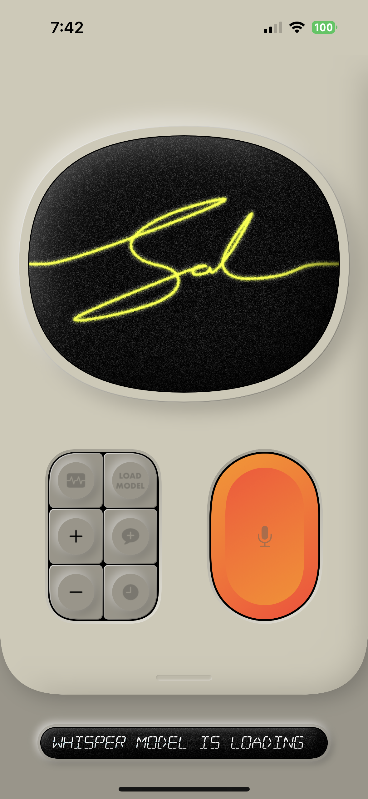
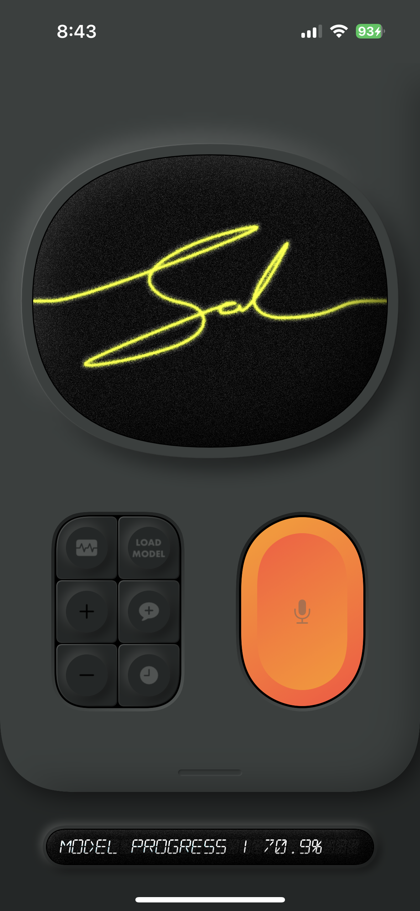

# Sal

Sal is a cross-platform conversational AI application featuring real-time speech recognition, text-to-speech synthesis, and large language model (LLM) chat capabilities. It leverages [WhisperKit](https://github.com/argmaxinc/whisperkit-coreml) for speech-to-text, eSpeak-NG for text-to-speech, and Llama.cpp for LLM inference. The app is built with SwiftUI and supports both macOS and iOS.

<p align="center">
    <a href="https://www.youtube.com/watch?v=dRzeFlbjfkY" target="_blank">
        
    </a>
    <a href="https://www.youtube.com/watch?v=lO_zQuAC0-k" target="_blank">
        
    </a>
    <a href="https://www.youtube.com/watch?v=NZe2YyFUsWs" target="_blank">
        
    </a>
</p>
<p align="center">
    <em>Sal in action</em>
</p>


## Features

- **Real-Time Speech Recognition:** Uses WhisperKit for accurate, on-device transcription.
- **Text-to-Speech Synthesis:** Integrates eSpeak-NG for fast, multi-language voice synthesis.
- **Conversational LLM:** Employs Llama.cpp for local, private AI chat.
- **Chat History:** Stores and manages previous conversations.
- **Customizable Models:** Download, select, and manage Whisper and Llama models.
- **Modern UI:** Neumorphic SwiftUI interface with animated controls and visual feedback.
- **Cross-Platform:** Runs on both macOS and iOS.

## Project Structure

```
Sal/
  SalApp.swift           # App entry point
  ContentView.swift      # Main UI
  backend/               # Core logic for Whisper, Llama, eSpeak, chat, and managers
  top_card/              # Main controls, TV view, settings, and Whisper UI
  bottom_card/           # Message board UI
  neumorphic/            # Custom SwiftUI styles and effects
  Resources/             # App resources
  Assets.xcassets/       # App icons and color assets
  ...
ESpeakExtension/
  SynthAudioUnit.swift   # eSpeak-NG AudioUnit implementation
  ...
SalTests/
SalUITests/
```

## Getting Started

### Prerequisites

- Xcode 15+
- Swift 5.9+
- macOS 14.5+ or iOS 17.5+
- [llama.cpp](https://github.com/ggerganov/llama.cpp) (via Swift Package)
- [WhisperKit](https://github.com/argmaxinc/whisperkit-coreml) (via Swift Package)
- [espeak-ng-spm](https://github.com/argmaxinc/espeak-ng-spm) (via Swift Package)

### Installation

1. **Clone the repository:**
   ```sh
   git clone https://github.com/ThyOwen/sal.git
   cd sal
   ```

2. **Open in Xcode:**
   - Open Sal.xcodeproj in Xcode.

3. **Resolve Swift Packages:**
   - Xcode should automatically fetch dependencies. If not, go to `File > Packages > Resolve Package Versions`.

4. **Build and Run:**
   - Select your target platform (macOS or iOS) and click Run.


<p align="center">
    
    
</p>
<p align="center">
    <em>Sal in Light and Dark Modes</em>
</p>


## Usage

- **Start the app:** On first launch, load or download the desired Whisper and Llama models.
- **Microphone Controls:** Use the main controls to start/stop recording and interact with the AI.
- **Chat History:** Switch between active chats and history using the controls.
- **Settings:** Adjust model, language, and sensitivity in the settings panel.

## Key Components

- `ContentView`: Main application view and layout.
- `ChatViewModel`: Central state and logic manager.
- `Whisper`: Handles speech-to-text.
- `ESpeak`: Handles text-to-speech.
- `Llama`: Handles LLM inference.
- `MessageBoardManager`: Manages status and temporary messages.

## Customization

- **Models:** Place additional Whisper or Llama models in the appropriate directories as prompted by the app.
- **UI:** Modify SwiftUI views in `top_card/`, `bottom_card/`, and `neumorphic/` for custom appearance.

## License

This project includes code under the GPL (eSpeak-NG) and other open-source licenses. See individual package licenses for details.

---

For more information, see the documentation in each module or contact the project maintainer.